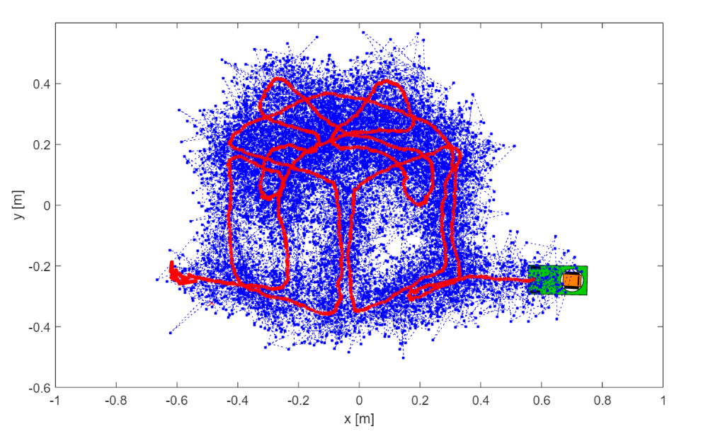
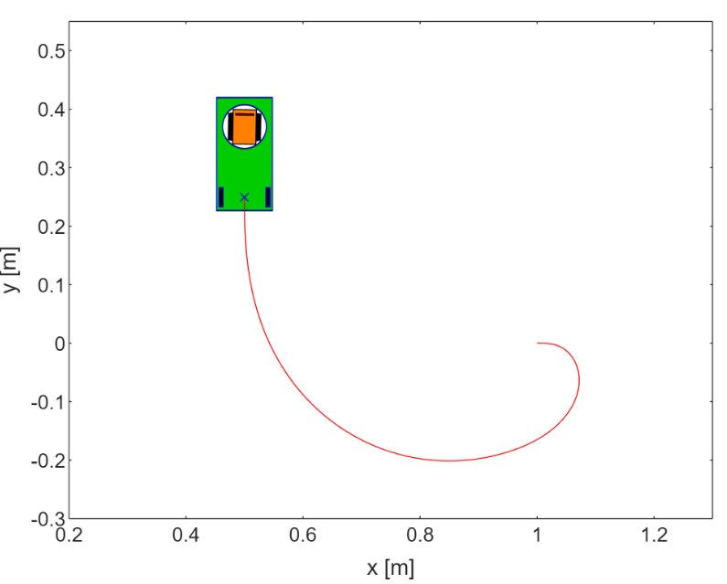
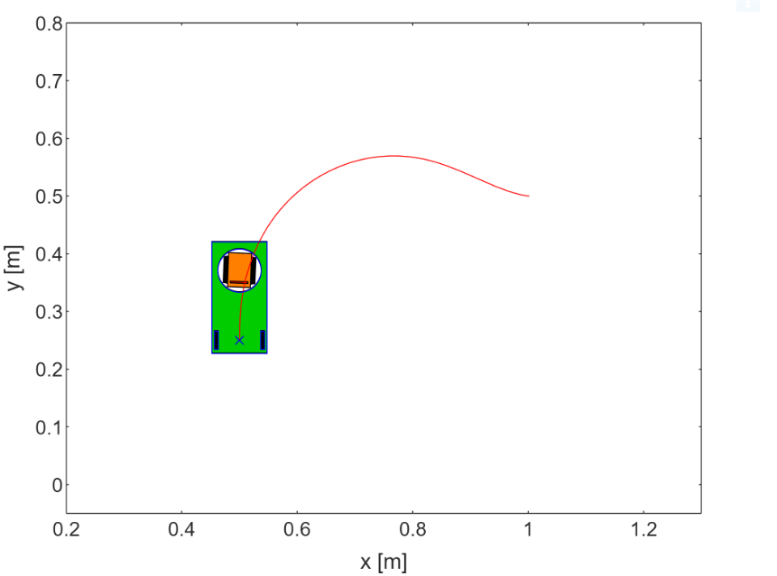
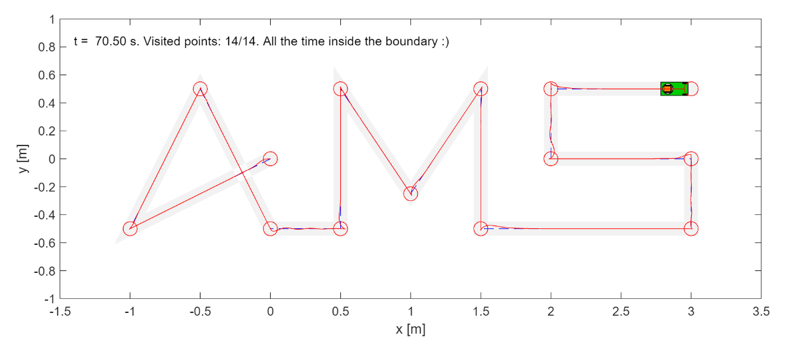
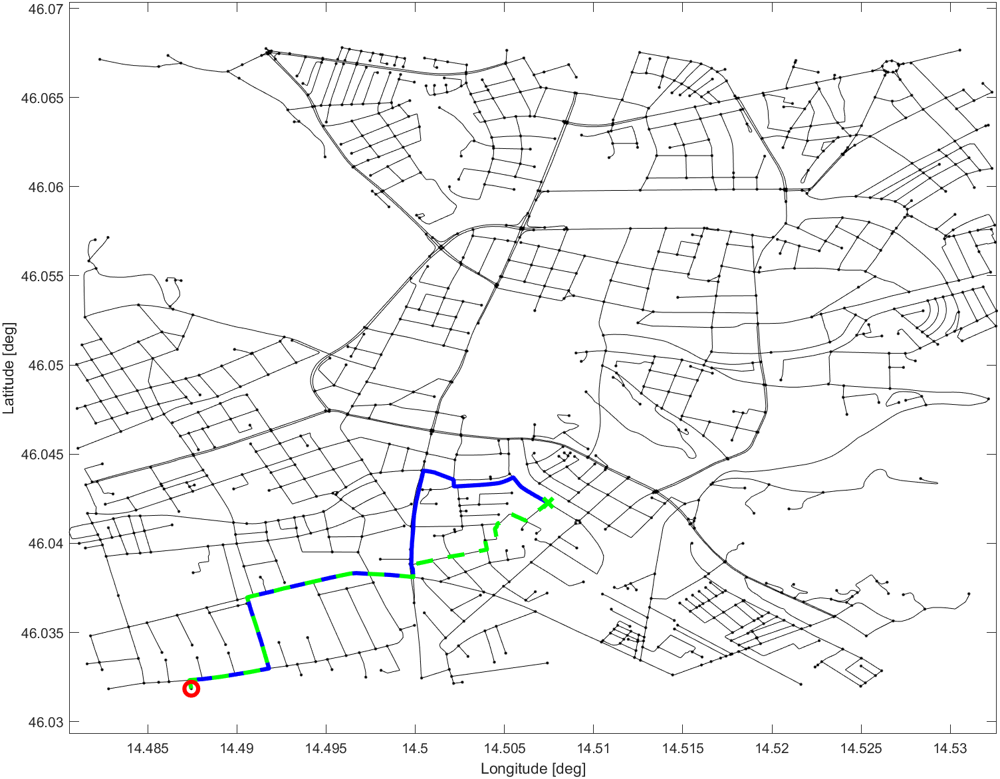

# Automated Guided Vehicle (AGV) Control System

## Overview
This project presents a sophisticated control system for an Automated Guided Vehicle (AGV). It integrates a variety of robotic principles and algorithms to offer a range of functionalities, including odometry, localization, path planning, and line following, all developed within the Robot Operating System (ROS) framework.

### Features
- **Odometry**: Implements motion tracking of the AGV for accurate positioning.
- **Kalman Filter**: Employed for enhanced localization of the vehicle, ensuring precision in navigation.
  
  

- **Control to Reference Point**: Enables the AGV to navigate and align with specific reference points.
  
  

    
    
    
  

- **Line Following**: Features an algorithm that allows the AGV to follow a predefined line path.

- **Path Planning using A***: Incorporates the A* algorithm for efficient and optimized path planning.
  
  

- **Python and ROS Integration**: Developed in Python, the system communicates effectively with ROS, showcasing seamless integration and operation.

### Technologies Used
- **Programming Language**: Python, a powerful, flexible language known for its readability and ease of use.
- **Framework**: Robot Operating System (ROS), a flexible framework for writing robot software, offering a collection of tools, libraries, and conventions.
- **Hardware**: Raspberry Pi, a compact and affordable computer, connected to our PC using SSH for remote access and control.
